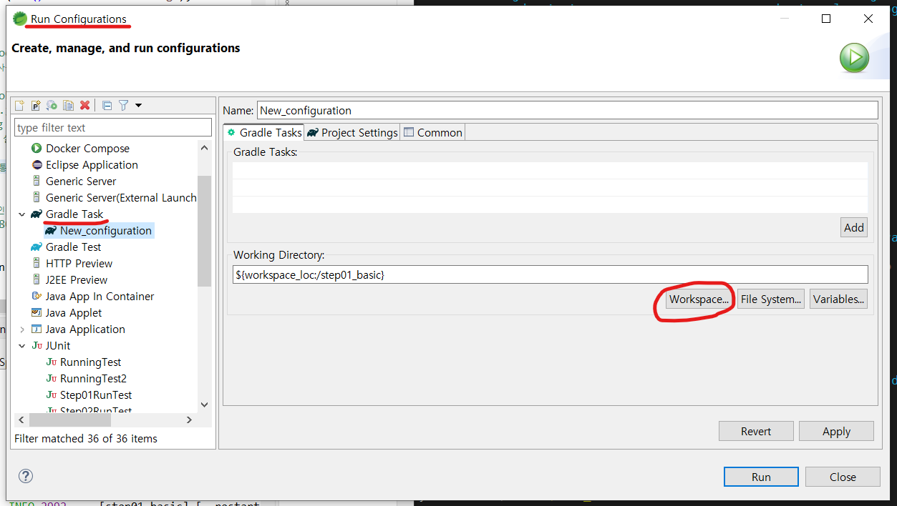
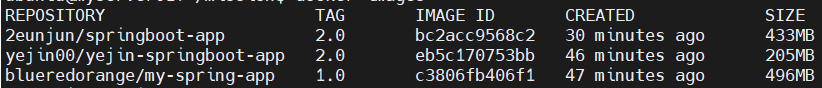
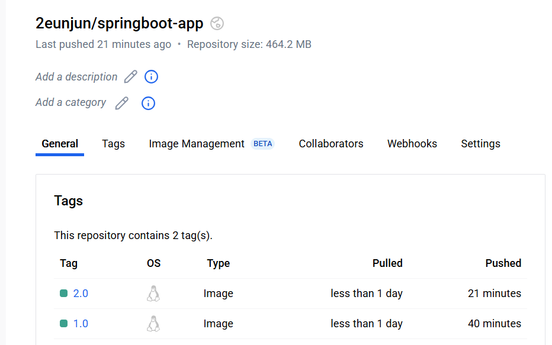
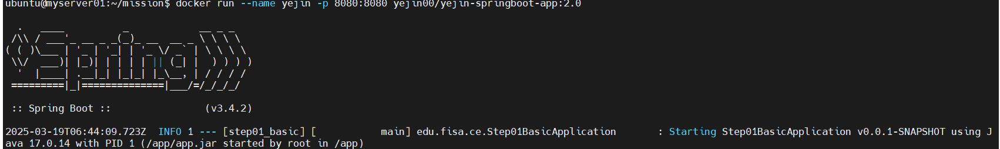
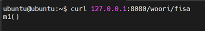
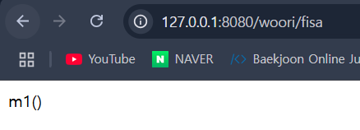

<div align="center">
<h1 style="font-size: 36px;">🚀 Docker 기반 Spring Boot Application 최적화 & 배포</h1>
</div>
</br>

## 목차
1. [🙆🏻‍♂️ 팀원](#%EF%B8%8F-팀원)
2. [🐳 프로젝트 개요 - Docker를 활용한 Spring Boot 배포](#-프로젝트-개요---Docker를-활용한-Spring-Boot-배포)
3. [🛠 미션 수행 과정](#-미션-수행-과정)
4. [📌 최종 과정 요약](#-최종-과정-요약)
5. [📚 프로젝트에서 배운 점](#-프로젝트에서-배운-점)

## 🙆🏻‍♂️ 팀원

#### 팀명 : Ctrl-4
우리FISA 4기 클라우드 엔지니어링 Ctrl-4팀

|||||
|:-:|:-:|:-:|:-:|
|김예진<br/>[@yeejkim](https://github.com/yeejkim)|이슬기<br/>[@seulg2027](https://github.com/seulg2027)|이은준<br/>[@2EunJun](https://github.com/2EunJun)|정파란<br/>[@BlueRedOrange](https://github.com/BlueRedOrange)|

---

<br>


## 🐳 프로젝트 개요 - Docker를 활용한 Spring Boot 배포

본 레퍼지토리는 Spring Boot 애플리케이션을 Docker 컨테이너로 패키징하여, DockerHub에 업로드하고, 다른 사용자가 이를 Pull하여 실행하는 과정을 수행합니다.

### 세부 목표
1. SpringBoot jar 파일 생성 & 실행
2. 이미지 패키징 
3. Dockerfile 최적화 
4. DockerHub push
5. 팀원들 간 pull 통한 실행 및 검증
---

## 🛠 미션 수행 과정

### **1️⃣ Spring Boot `.jar` 파일 생성**

- Spring Boot 프로젝트를 빌드하여 실행 가능한 `.jar` 파일 생성

- STS 기준: Run As > Run Configurations > Gradle Task 
---

### **2️⃣ Dockerfile 작성**

- Spring Boot 애플리케이션을 컨테이너로 배포하기 위해 최적화 Dockerfile 작성
- 이 과정에서 불필요한 용량을 줄이고, 실행 성능을 향상시키기 위해 **JRE 기반의 가벼운 환경** 사용

### 💫 Dockerfile 최적화 포인트

📌 김예진 **Dockerfile**

<details>
  <summary>Dockerfile 보기</summary>

  ```bash
  # 1. 가벼운 JRE 기반 이미지 사용 (Alpine 기반)
  FROM eclipse-temurin:17-jre-alpine

  # 2. 작업 디렉토리 설정
  WORKDIR /app

  # 3. JAR 파일 복사 (미리 설정된 작업 디렉토리로 복사)
  COPY step01_basic-0.0.1-SNAPSHOT.jar app.jar

  # 4. 실행 명령어 설정 (JVM 최적화 옵션 추가)
  ENTRYPOINT ["java", "-XX:+UseContainerSupport", "-XX:MaxRAMPercentage=75.0", "-jar", "app.jar"]
```
</details> 

✅ **최적화 포인트**

1. **가장 가벼운 실행 환경** → JDK가 아닌 JRE 기반이며, `Alpine` 사용으로 이미지 크기가 최소화됨
2. **JVM 최적화 적용** → `XX:+UseContainerSupport` 및 `XX:MaxRAMPercentage=75.0` 옵션을 추가하여 컨테이너 환경에서 메모리 활용도를 최적화
3. **보안성이 높음** → Alpine 기반은 불필요한 패키지가 적고, 공격 표면이 작아 보안 리스크가 낮음


📌 이은준 **Dockerfile**
<details>
  <summary>Dockerfile 보기</summary>

  ```bash
  # 1. 공식 OpenJDK 기반 이미지 사용 (최적화된 JRE 환경)
FROM openjdk:17-jdk-slim

# 2. 작업 디렉토리 설정
WORKDIR /app

# 3. 현재 디렉토리의 JAR 파일을 컨테이너로 복사
COPY step01_basic-0.0.1-SNAPSHOT.jar /app/app.jar

# 4. 실행 명령 설정
CMD ["java", "-jar", "/app/app.jar"]
```
</details> 

✅ **최적화 포인트**

1. **경량화된 JDK 환경** → `slim` 버전 사용으로 불필요한 패키지를 제거하여 이미지 크기 감소
2. **기본적인 glibc 호환성 제공** → Alpine 기반보다 기본적으로 널리 사용되는 라이브러리와 호환성이 좋음
3. **메모리 및 디스크 사용량 절감** → 일반 `openjdk:17-jdk` 대비 가볍고, 컨테이너 리소스를 덜 차지함


📌 정파란 **Dockerfile**
<details>
  <summary>Dockerfile 보기</summary>

  ```bash
  # 1. OpenJDK 17
FROM openjdk:17-jdk

# 2. 애플리케이션 실행
WORKDIR /app

# 3. JAR 파일을 컨테이너 내부 /app 디렉토리로 복사
COPY step01_basic-0.0.1-SNAPSHOT.jar app.jar

# 4. 실행 명령어 설정
CMD ["java", "-jar", "app.jar"]
```
</details> 

✅ **최적화 포인트**

1. **개발 환경과 동일** → JDK를 포함하여 로컬 개발 환경과 컨테이너 환경 간의 차이가 없음
2. **디버깅 및 테스트 용이** → JDK가 포함되어 있어 런타임에서 추가적인 디버깅 및 문제 해결 가능
3. **추가 종속성 설치 가능** → JDK 환경이므로 필요할 경우 추가 패키지를 쉽게 설치할 수 있음


💙 **각 Dockerfile 조회 및 비교**



- **개발 및 디버깅이 중요한 경우** → `정파란 Dockerfile (openjdk:17-jdk)`
- **적절한 경량화와 호환성을 원하면** → `이은준 Dockerfile (openjdk:17-jdk-slim)`
- **가장 최적화된 실행 환경이 필요하면** → `김예진 Dockerfile (eclipse-temurin:17-jre-alpine)`

### **4️⃣** Docker 이미지 태그

- 이미지 태그 지정
    
    ```bash
    $docker tag <IMAGE NAME> <DOCKERHUB ID/IMAGE NAME:TAG>
    ```
    
    - <DOCKERHUB ID/IMAGE NAME:TAG> : Docker Hub에 업로드할 때 사용할 이름과 태그
    - 같은 이미지로 Tag만 다르게 한다면 동일 레포지토리에 업로드
    
    


### **5️⃣  DockerHub 로그인 & 이미지 푸시**

- 생성한 이미지 DockerHub Push

### **📌 5-1. Docker Hub 로그인**

```bash
$docker login -u <DockerHub ID>
```

- **"Login Succeeded"** 메시지 확인

### **📌 5-2. DockerHub Push**

```bash
$docker push <DOCKERHUB ID/IMAGE NAME:TAG>
```

- **Docker Hub에서 푸시된 이미지 확인**
- DockerHub에서 **`2eunjun/springboot-app:1.0`** 이미지 확인 가능


### **6️⃣ Pull하여  Container 실행**

- Docker Hub에 업로드된 이미지를 다른 팀원이 Pull하여 실행

### **📌 6-1. DockerHub Pull**

```bash
# 이미지 Pull
$docker pull <IMAGE NAME:TAG>

# 확인
$docker images
```

### **📌 6-2. Container 실행**

```bash
# 기본 실행
$docker run --name <설정할 이름> -p <호스트 포트>:<컨테이너 포트> <IMAGE NAME>

# 백그라운드(Detached mode) 실행 (-d 옵션)
$docker run -d --name <설정할 이름> -p <호스트 포트>:<컨테이너 포트> <IMAGE NAME>

# 실행된 컨테이너 목록 확인
$docker ps
```

### **📌 6-3. 동작 확인**

- **컨테이너에서 실행 중인 Spring Boot 애플리케이션이 정상적으로 응답하는지 확인**
    
    
    
1. 터미널에서 curl 통해 확인
    
    ```bash
    $curl http://localhost:8080/woori/fisa
    ```
    
    
    
2. 포트포워딩을 진행한 경우, 웹 브라우저에서 확인 가능
    
    ```bash
    	http://localhost:8080/woori/fisa
    ```
    
    
---


## **📌 최종 과정 요약**

| 단계 | 명령어 |
| --- | --- |
| **Spring Boot `.jar` 실행 확인** | `java -jar step01_basic-0.0.1-SNAPSHOT.jar` |
| **Docker 이미지 Build** | `docker build -t <DockerHub ID>/<Image Name:tag> .` |
| **DockerHub 로그인** | `docker login -u <DockerHub ID>` |
| **DockerHub Push** | `docker push <DockerHub ID>/<Image Name:tag>` |
| **이미지 Pull** | `docker pull <(DockerID포함)Image Name:tag>` |
| **컨테이너 실행** | `docker run --name <Container Name> -p <Host Port:Container Port> <(DockerID포함)Image Name>` |
| **실행 확인** | `docker ps` |
---

## **📚 프로젝트에서 배운 점**
- Docker를 활용한 Spring Boot 애플리케이션 패키징 및 배포 프로세스 숙지
- Docker Hub를 통한 이미지 공유 및 협업 방식 이해
- 최적화된 `Dockerfile` 작성법

